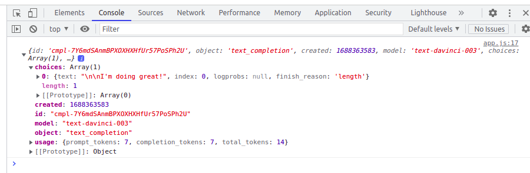

# chatGPTAPI
ChatGptPrompy Api


### basic testing:


#### on Web console

#### 

```js
prompt: "hello, how are you today?"
```





#### Running app.js

```js
prompt: "how many planets are there in solar system?"
```


```bash
chakravarti@chakravarti-Latitude-7280:~/GitHubRepos/chatGPTAPI/chatgptapi$ node src/app.js 
{
  id: 'cmpl-7Y71zgtx3JJCAbH2y4V4eSIduQpHF',
  object: 'text_completion',
  created: 1688364535,
  model: 'text-davinci-003',
  choices: [
    {
      text: '\n\nThere are eight planets in',
      index: 0,
      logprobs: null,
      finish_reason: 'length'
    }
  ],
  usage: { prompt_tokens: 9, completion_tokens: 7, total_tokens: 16 }
```

